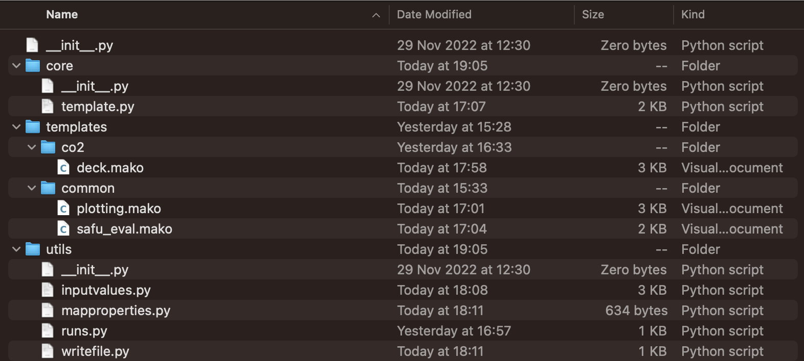

expreccs Python API
===================

The executable coordinates integrated or existing-deck workflows. Mako templates generate OPM input; utilities process configuration, run reference, regional, and site simulations, and project dynamic boundaries; visualization modules compare results.

API files are regenerated beneath ``docs/text/api`` before each build.

.. toctree::
   :maxdepth: 2

   api/modules
