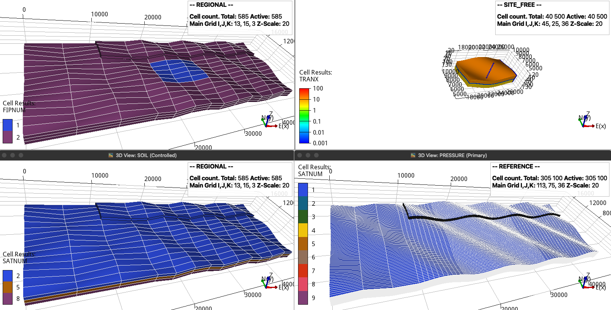

Integrated models and geometry
==============================

This part of the configuration defines the OPM Flow command, regional and
reference grids, embedded site model, faults, reservoir geometry, and initial
conditions.

OPM Flow command
----------------

``flow`` is a non-empty string containing the OPM Flow executable and simulator
flags. Do not add ``--output-dir`` because expreccs manages output directories.
If Flow is not on ``PATH``, use its full path. An MPI launcher and any required
simulator options may be included in the same string.

.. code-block:: toml

   flow = "flow --relaxed-max-pv-fraction=0 --enable-opm-rst-file=true --newton-min-iterations=1"

For supported simulator flags, see the `OPM Flow command-line reference
<https://opm-project.org/?page_id=955>`_.

Regional model
--------------

``regional_dims`` defines the regional aquifer length, width, and depth in
metres. The origin is the lower-left corner. ``regional_x_n``,
``regional_y_n``, and ``regional_z_n`` are variable refinement arrays for the
regional grid.

.. code-block:: toml

   regional_dims = [45000, 15000, 81]
   regional_x_n = [3, 5, 5]
   regional_y_n = [5, 5, 5]
   regional_z_n = [1, 1, 1]

Reference model
---------------

The reference model represents the higher-resolution comparison solution.
``reference_x_n``, ``reference_y_n``, and ``reference_z_n`` define its variable
refinement.

.. code-block:: toml

   reference_x_n = [1, 1, 1, 5, 5, 15, 15, 15, 15, 15, 5, 5, 5, 5, 5]
   reference_y_n = [25, 25, 25]
   reference_z_n = [6, 5, 5, 5, 3, 3, 3, 3, 3]

Site model
----------

``site_location`` defines the site box inside the regional model as
``[xi, yi, zi, xf, yf, zf]`` in metres.

.. code-block:: toml

   site_location = [18000, 5000, 0, 27000, 10000, 81]

Faults
------

``fault_regional`` defines the regional fault x and y positions, x and y
transmissibility multipliers, and vertical jump. ``fault_site`` defines the
initial and final x-y coordinates of the site fault and its transmissibility
multipliers. The site fault follows a zigzag path between its endpoints.

.. code-block:: toml

   fault_regional = [10000, 11000, 0.01, 10, 22.5]
   fault_site = [[21583, 5710], [24081, 8233], [0, 0]]

Layers and reservoir conditions
-------------------------------

``thickness`` contains one thickness per layer in metres. ``pressure`` is the
reservoir-top pressure in bar, ``temperature`` contains top and bottom
temperatures in degrees Celsius, and ``rock_comp`` is rock compressibility in
inverse bar.

``sensor_coords`` defines the x, y, and z position used to compare site and
reference results. ``z_xy`` is a Python expression for the reservoir surface as
a function of x and y.

.. code-block:: toml

   thickness = [9, 9, 9, 9, 9, 9, 9, 9, 9]
   pressure = 2E2
   temperature = [60, 50]
   rock_comp = 6.11423e-5
   sensor_coords = [20000, 8000, 0]
   z_xy = "(20-20*mt.sin((2*mt.pi*(x+y)/10000)))"

Generated grids
---------------

   Site location in the regional model, the site fault, and the rock-property
   regions in the regional and reference models. The coarser regional cells
   retain the closest rock properties.
