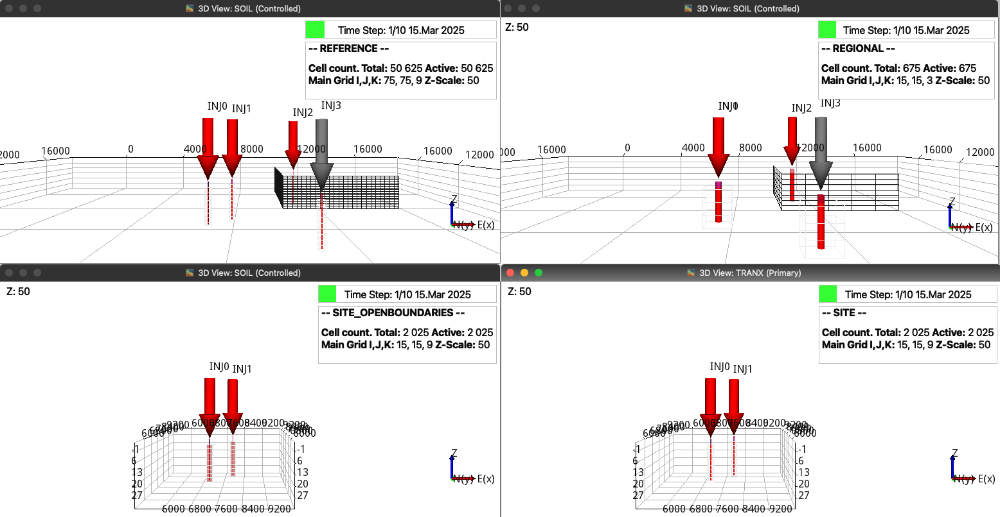
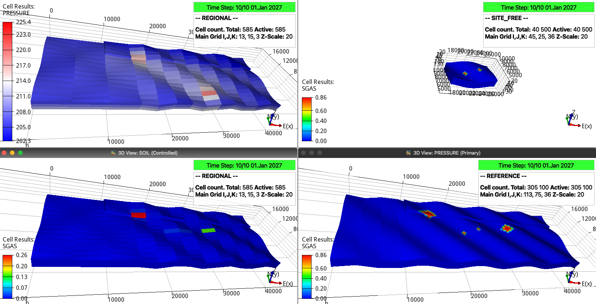

Wells, schedules, and TUNING
============================

The well and schedule settings define well trajectories, injected fluid,
injection rates, report frequency, optional site-boundary wells, and OPM Flow
TUNING values.

Well coordinates
----------------

Each ``well_coords`` row contains x, y, initial z, and final z positions in
metres. Any number of wells can be added to the site and regional models.

.. code-block:: toml

   well_coords = [
       [21180, 7068, 0, 81],
       [24200, 7800, 15, 65],
       [21718, 7122, 45, 81],
       [14518, 11377, 0, 50],
       [31679, 8883, 0, 30],
       [28477, 2732, 0, 81],
   ]

   Well locations in the regional, site, and reference models. In the coarser
   regional model, wells 0 and 2 share cells along the z direction.

Schedule structure
------------------

Each ``inj`` entry contains two arrays. The first contains injection duration,
regional output time step, and site/reference output time step in days. The
second contains one fluid identifier and injection rate pair per well. Fluid 0
is water and fluid 1 is CO2; rates are in kg/day.

For six wells, each schedule row contains the three timing values and 12
fluid-rate values. When ``site_bctype`` is ``wells``, append boundary-well
controls in bottom, right, top, and left order. Each control contains 0 for a
producer or 1 for an injector, followed by BHP in bar.

The full nested schedule from ``input.toml`` is retained in :doc:`complete`.
See `example1_wells.toml
<https://github.com/cssr-tools/expreccs/blob/main/examples/example1_wells.toml>`_
for a boundary-well case.

TUNING
------

If the Flow command enables TUNING, add a string to each timing array. The
string follows the OPM TUNING record order. OPM Flow supports 34 options and
uses defaults for omitted entries.

For example, the following strings retain the first default and set ``TSMAXZ``
to 10 and 20 days:

.. code-block:: toml

   inj = [
       [[365, 73, 73, "1* 10"], [1, 3e5, 1, 3e5, 1, 3e5, 1, 5e6, 1, 5e6, 0, 1e7]],
       [[365, 73, 73, "1* 20"], [1, 3e5, 1, 3e5, 1, 3e5, 1, 5e6, 1, 0, 0, 1e7]],
   ]

TUNING can restrict time steps during high injection and relax them while wells
are shut. Consult the OPM Flow manual for all records and defaults. A related
multi-record example is available in `pyopmspe11
<https://github.com/OPM/pyopmspe11/blob/main/examples/tuning.toml>`_.

Run the integrated study
------------------------

When the configuration is named ``input.toml``, run:

.. code-block:: console

   expreccs

   ResInsight visualization of pressure and gas saturation. The intended next
   comparison projects regional fluxes or pressures to the site boundaries
   instead of using open boundaries.
