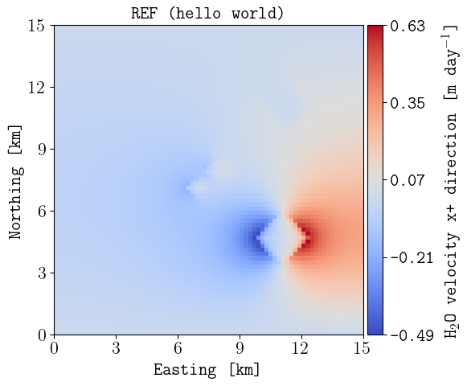
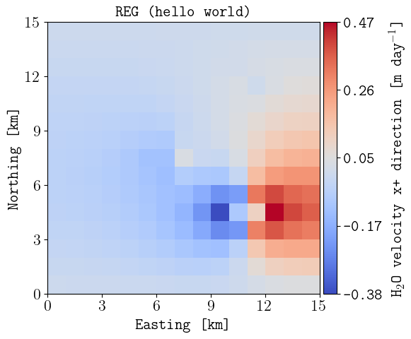
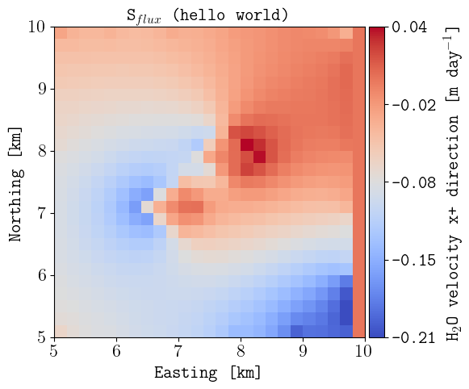
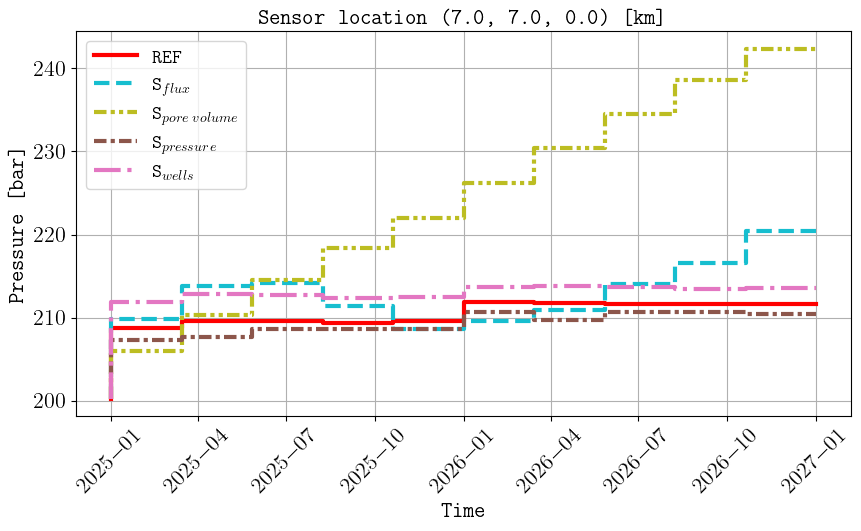
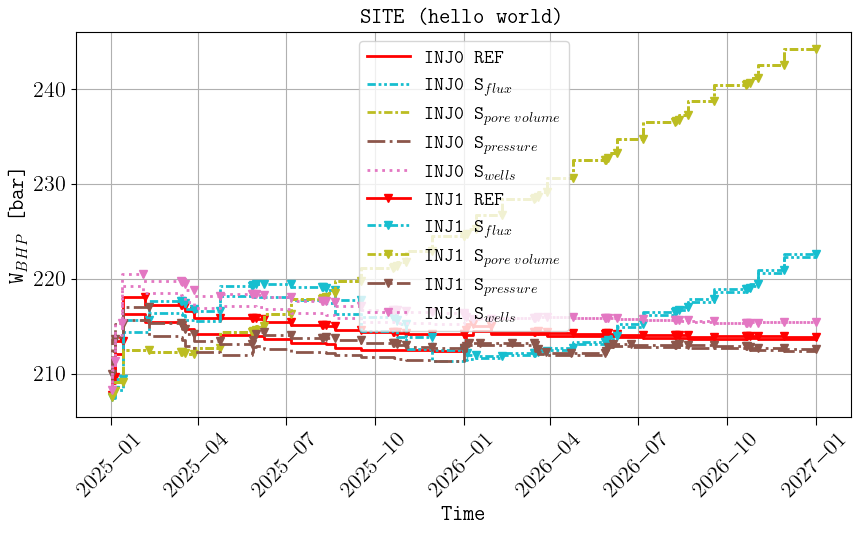
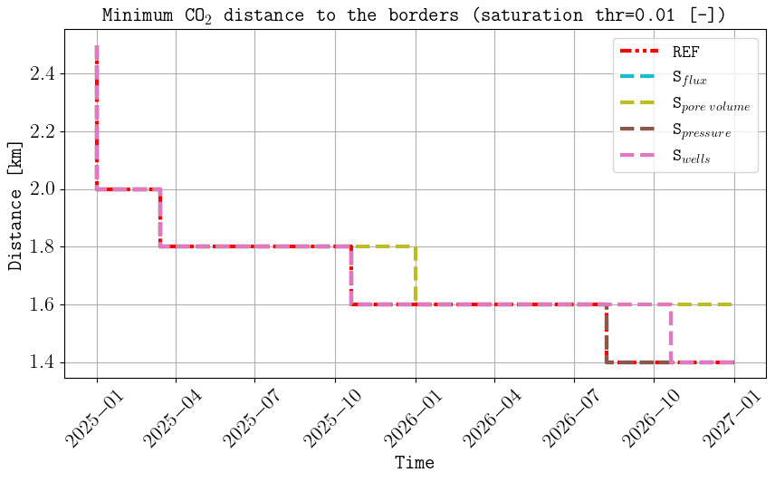

Hello world
===========

We consider the configuration file `example1.toml <https://github.com/cssr-tools/expreccs/blob/main/examples/example1.toml>`_ in the 
examples folder (the animation in the `GitHub home page <https://github.com/cssr-tools/expreccs>`_ was based on this configuration file). 
If the results are to be saved in a folder called 'hello_world', this is achieved by the following command: 

.. code-block:: bash

    expreccs -i example1.toml -o hello_world

Then we can change in line 25 the BC type for the site from
'flux' to 'pres', and run the following command to only simulate the site model:

.. code-block:: bash

    expreccs -i example1_pres.toml -o hello_world -m site

We can do the same to add the pore volumes from the regional reservoir on the site boundaries by setting in line 25
'porvproj':

.. code-block:: bash

    expreccs -i example1_porvproj.toml -o hello_world -m site

Finally, we consider the case where we add injector/producers on the site boundary, and to also visualize the results 
in PNGs figures, we run the following command:

.. code-block:: bash

    expreccs -i example1_wells.toml -o hello_world -m site -p yes

Below are some of the figures generated inside the postprocessing folder:

    Final water velocity (m/day) in the x direction for (top) the reference, (middle) regional, and 
    (bottom) site (with fluxes as BC). The figure names in the postprocessing folder are hello_world_reference_watfluxi+.png,
    hello_world_regional_watfluxi+.png, and hello_world_site_flux_watfluxi+.png respectively. 

    
    Comparison of cell pressures on the sensor location (top), well BHPs (middle), and minimum
    distance from the CO2 plume to the site boundaries (bottom). The figure names in the postprocessing folder are 
    hello_world_sensor_pressure_over_time.png, hello_world_summary_BHP_site_reference.png, and 
    hello_world_distance_from_border.png respectively

Reproduce the example
---------------------

Run the maintained script from the repository root:

.. code-block:: console

   . ./tests/scripts/docs_hello_world.sh

.. grid:: 1 1 2 2
   :gutter: 2

   .. grid-item::

      .. button-link:: https://github.com/cssr-tools/expreccs/blob/main/tests/scripts/docs_hello_world.sh
         :color: primary
         :outline:
         :expand:

         View script

   .. grid-item::

      .. button-link:: https://raw.githubusercontent.com/cssr-tools/expreccs/main/tests/scripts/docs_hello_world.sh
         :color: primary
         :outline:
         :expand:

         View raw script

.. button-ref:: ../examples
   :color: primary

   Back to examples gallery
