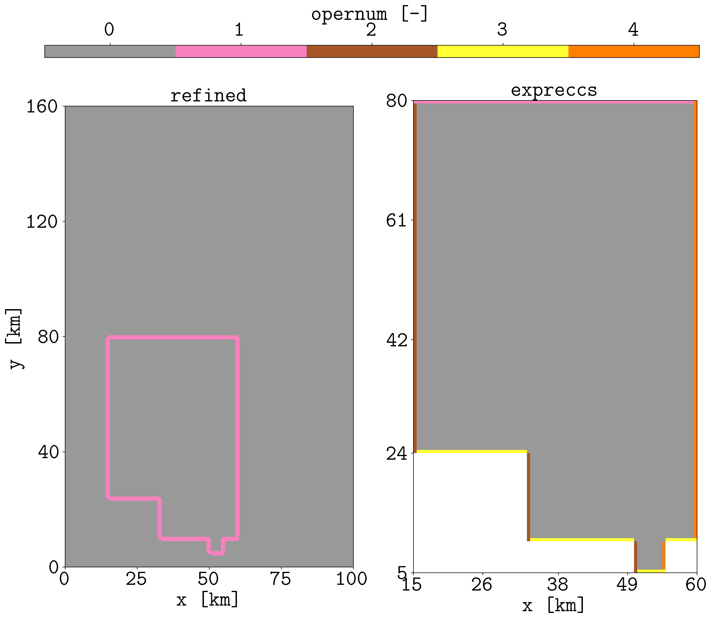

Non-regular boundaries
======================

The previous examples show the application to sites with regular boundaries, i.e., prescribed in a rectangle. This example shows how the flag
**-n 1** can be used to project the pressures in a non-regular boundary. For simplicity, this example does not include wells in the schedule, but
you can add wells if you are curious.

We start with a deck with only one cell, then we refine the deck, and after we extract the submodel. To this end, we use another friend: **pycopm**. 

.. tip::
    You can install `pycopm <https://github.com/cssr-tools/pycopm>`_ by executing in the terminal:
    
    .. code-block:: bash

        pip install git+https://github.com/cssr-tools/pycopm.git

The terminal commands are the following in the same location as the `SIMPLE.DATA <https://github.com/cssr-tools/expreccs/blob/main/examples/SIMPLE.DATA>`_ deck

.. code-block:: bash

    pycopm -i SIMPLE.DATA -l R -w REFINED -g 199,319,0
    pycopm -i REFINED.DATA -l S -w SUBMODEL -v 'xypolygon [15e3,80e3] [60e3,80e3] [60e3,10e3] [55e3,10e3] [55e3,05e3] [50e3,05e3] [50e3,10e3] [33e3,10e3] [33e3,24e3] [15e3,24e3] [15e3,80e3]' -p 0 -m all

The previous commands generate two decks: REFINED.DATA and SUBMODEL.DATA, where the former one is our regional model and the latter one the SITE model. We proceed to run the models:

.. code-block:: bash

    flow REFINED.DATA
    flow SUBMODEL.DATA

Now we can apply **expreccs** and run the generated model:

.. code-block:: bash

    expreccs -i "REFINED SUBMODEL" -n 1 -o expreccs
    flow expreccs/EXPRECCS.DATA

For the following figure, it is necessary to include in the REGIONS section of the REFINED.DATA the file "OPERNUM_EXPRECCS.INC" and rerun it. Then, using **plopm**:

.. code-block:: bash

    plopm -i 'REFINED expreccs/EXPRECCS' -v opernum -s ',,1 ,,1' -r 0 -xu km -xnt 5 -yu km -yf .0f -ynt 5 -xf .0f -sg 1,2 -fs 16,12 -cbp 0.1,0.95,0.8,0.02 -fz 30 -c Set1_r

    
    In the regional model (left), **expreccs** writes the location of the overlapping cells with the site model in the OPERNUM variable, while in the 
    site model this variable is used to label the ij direction of the boundary conditions.

Reproduce the example
---------------------

Run the maintained script from the repository root:

.. code-block:: console

   . ./tests/scripts/docs_non-regular_boundaries.sh

.. grid:: 1 1 2 2
   :gutter: 2

   .. grid-item::

      .. button-link:: https://github.com/cssr-tools/expreccs/blob/main/tests/scripts/docs_non-regular_boundaries.sh
         :color: primary
         :outline:
         :expand:

         View script

   .. grid-item::

      .. button-link:: https://raw.githubusercontent.com/cssr-tools/expreccs/main/tests/scripts/docs_non-regular_boundaries.sh
         :color: primary
         :outline:
         :expand:

         View raw script

.. button-ref:: ../examples
   :color: primary

   Back to examples gallery
