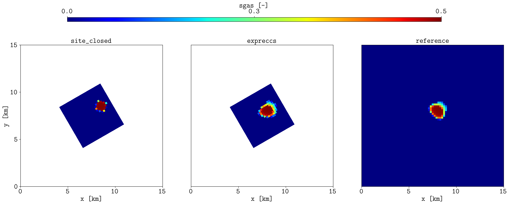
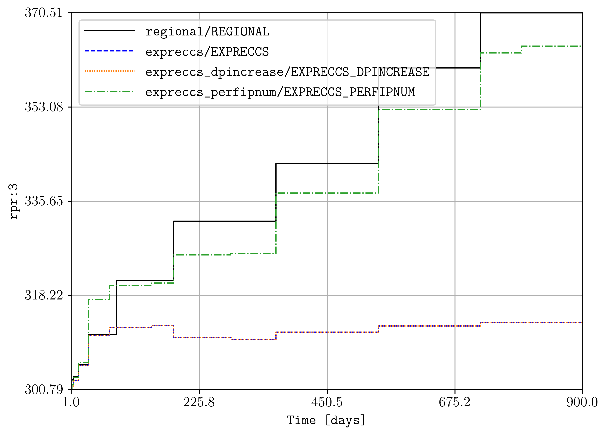

Regular boundaries
==================

See/run the `test_2_generic_deck.py <https://github.com/cssr-tools/expreccs/blob/main/tests/test_2_generic_deck.py>`_ 
for an example where **expreccs** is used in two given models (regional and site, in this case they are created using
the **expreccs** package, but in general can be any given geological models), generating a new input deck where
the pressures are projected.

.. code-block:: bash

    expreccs -i 'path_to_the_regional_model path_to_the_site_model'

For example, to run the test, this can be achieved by executing:

.. code-block:: bash

    pytest --cov=expreccs --cov-report term-missing tests/test_2_generic_deck.py

To visualize/compare results between the model with static (input) and dynamic (generated by expreccs) boundary conditions, 
we can use our friend `plopm <https://github.com/cssr-tools/plopm>`_: 

.. code-block:: bash

    plopm -i 'tests/configs/rotate/simulations/site_closed/SITE_CLOSED tests/configs/rotate/simulations/expreccs/EXPRECCS tests/configs/rotate/simulations/reference/REFERENCE' -v sgas -s ',,1 ,,1 ,,1' -sg 1,3 -st 0 -cbp 0.2,0.95,0.6,0.02 -fs 24,8 -cbf .1f -fz 20 -xu km -yu km -xf .0f -yf .0f -x '[0,15000]' -y '[0,15000]' -rdl 1

    
    Comparison of the gas saturation on the top cells at the end of the simulations.

.. tip::
    You can install `plopm <https://github.com/cssr-tools/plopm>`_ by executing in the terminal:
    
    .. code-block:: bash

        pip install git+https://github.com/cssr-tools/plopm.git

See also the `test_4_site_regional.py <https://github.com/cssr-tools/expreccs/blob/main/tests/test_4_site_regional.py>`_, where the 
two-stage approach is demonstrated in a site and regional deck generated using `sandwich.toml <https://github.com/cssr-tools/expreccs/blob/main/examples/sandwich.toml>`_. In this test 
the functionality to select if the boundary-condition mappings are written per fipnums, i.e., if there is an offset between the site and regional models along the z direction, then 
using **-z 1** builds the interpolators per corresponding fipnums in the regional and site models. In addition, the flag **-e 0** sets the interpolators to be defined by pressure increase and
not by pressure values. If you run that test, then using plopm:

.. code-block:: bash

    plopm -i 'tests/regional/REGIONAL tests/expreccs/EXPRECCS tests/expreccs_dpincrease/EXPRECCS_DPINCREASE tests/expreccs_perfipnum/EXPRECCS_PERFIPNUM' -v rpr:3 -sp 1

    
    Comparison of the different functionality to map the dynamic boundary conditions. Here, rpr:3 (fipnum equal to 3) corresponds to the top part of the sandwich (three layers with the middle layer inactive) 
    in the regional model, while to the bottom part in the site model.

Reproduce the example
---------------------

Run the maintained script from the repository root:

.. code-block:: console

   . ./tests/scripts/docs_regular_boundaries.sh

.. grid:: 1 1 2 2
   :gutter: 2

   .. grid-item::

      .. button-link:: https://github.com/cssr-tools/expreccs/blob/main/tests/scripts/docs_regular_boundaries.sh
         :color: primary
         :outline:
         :expand:

         View script

   .. grid-item::

      .. button-link:: https://raw.githubusercontent.com/cssr-tools/expreccs/main/tests/scripts/docs_regular_boundaries.sh
         :color: primary
         :outline:
         :expand:

         View raw script

.. button-ref:: ../examples
   :color: primary

   Back to examples gallery
