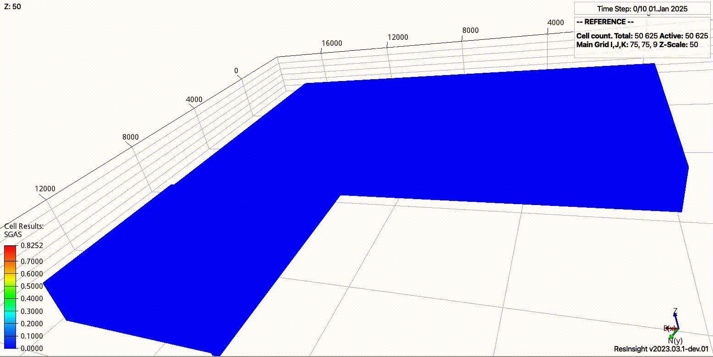
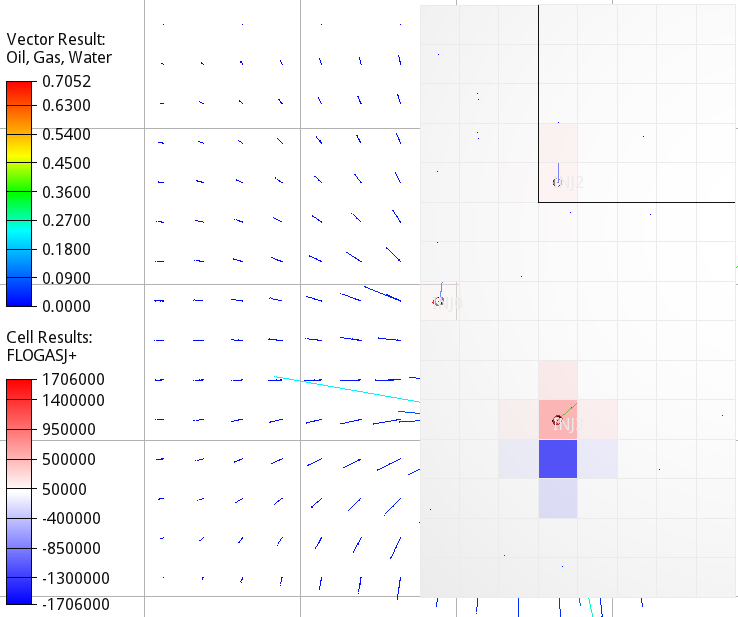

.. _introduction:

Introduction
============

**expreccs** is a simplified and flexible framework for testing a two-stage
approach with dynamic pressure boundary conditions in regional and site-scale
CO2 storage simulations. It can generate integrated modeling studies or project
dynamic boundary conditions between existing OPM Flow models with
nonconforming grids.

Core concept
------------

The two-stage workflow connects a computationally efficient regional model with
a higher-resolution site model:

#. Simulate the regional model through all report steps.
#. Identify the regional connections corresponding to the site-model boundary.
#. Project regional pressures, pressure increases, fluxes, or pore-volume
   effects to the site boundary.
#. Simulate the site model with dynamically updated boundary conditions.
#. Compare the site result with a higher-resolution reference model when one is
   available.

This approach accounts for regional pressure interference without requiring the
complete regional grid resolution inside every site-scale simulation.

Supported model sources
-----------------------

expreccs supports two main ways of defining a study.

Integrated configuration
~~~~~~~~~~~~~~~~~~~~~~~~

A :doc:`configuration file <configuration_file>` can generate the reference,
regional, and site models together with their rock properties, faults, wells,
schedules, and boundary conditions.

Existing OPM Flow models
~~~~~~~~~~~~~~~~~~~~~~~~

Existing regional and site OPM Flow decks can be supplied directly. Their grids
do not need to conform. expreccs identifies the overlapping region, constructs
the boundary mappings, processes the regional results, and writes the dynamic
boundary updates required by the site model.

Core workflows
--------------

* Generate corner-point grids for reference, regional, and site models.
* Define heterogeneous rock and saturation properties.
* Add faults, hysteresis, salinity, wells, and operational schedules.
* Run complete, reference-only, regional-only, site-only, or
  regional-and-site workflows.
* Project pressure, pressure increase, flux, or pore-volume effects.
* Apply dynamic conditions to regular or irregular site boundaries.
* Interpolate projected values between regional report steps.
* Construct projections by corresponding FIPNUM regions when the regional and
  site models have a vertical offset.
* Compare reference, regional, and site simulations.
* Generate figures for pressure, gas saturation, well behavior, sensor
  pressure, and boundary effects.
* Support model coarsening, optimization, and reproducible research workflows.

Basic usage
-----------

Run an integrated study defined by a TOML file:

.. code-block:: console

   expreccs -i examples/example1.toml -o hello_world

Project dynamic boundary conditions between existing regional and site models:

.. code-block:: console

   expreccs -i "tests/regional/REGIONAL tests/site/SITE" -o projected

Display the available command-line options:

.. code-block:: console

   expreccs --help

Use :doc:`command-line` for exact syntax, defaults, and option compatibility.
See :doc:`examples` for complete integrated, existing-deck, regular-boundary,
and irregular-boundary workflows.

Research development
--------------------

The **expreccs** Python tool was used to generate the published results for the
hierarchical regional-to-site modeling study:

   Tveit, S., Gasda, S. E., Landa-Marbán, D., and Sandve, T. H. (2025).
   A hierarchical approach for modeling regional pressure interference in
   multi-site CO2 operations. *Geoenergy Science and Engineering*, 248,
   213733. https://doi.org/10.1016/j.geoen.2025.213733

The scripts and configurations used to reproduce that study are available in
the `examples/paper_2025 directory
<https://github.com/cssr-tools/expreccs/tree/main/examples/paper_2025>`_.

The directory contains four study folders:

* ``Case1``
* ``Case2``
* ``Case3``
* ``Case4``

These cases use **expreccs** and implement the regional-to-site modeling and
dynamic boundary-condition studies described in the paper. They remain
available as publication-supporting examples in the repository but do not have
a separate reproduction page in the online documentation.

Related project publications
----------------------------

The expreccs repository also hosts the reproducibility material for TCCS-13 and
ECMOR 2026. These studies are contributions from the broader expreccs research
project and address model coarsening, pressure communication, and large-scale
CO2 storage simulation.

Unlike the 2025 hierarchical regional-to-site study, the TCCS-13 and ECMOR
2026 reproduction workflows do not use the **expreccs** Python executable. They
are hosted in this repository because they were developed within the same
research project and share its OPM Flow modeling, preprocessing, visualization,
and reproducibility infrastructure.

TCCS-13
~~~~~~~

The :doc:`tccs-13` page documents the Troll aquifer coarsening and optimization
study. Its workflow uses OPM Flow, pycopm, plopm, Everest, ResInsight, and
supporting Python and shell scripts. It does not invoke the **expreccs**
executable.

ECMOR 2026
~~~~~~~~~~

The :doc:`ecmor2026` page documents the explicit non-net-cell treatment study
for improving pressure communication in coarsened aquifer models. Its workflow
uses OPM Flow, pycopm, plopm, ResInsight, ParaView, and supporting Python and
shell scripts. It does not invoke the **expreccs** executable.

About the project
-----------------

**expreccs** is funded by Harbour Energy, Equinor, Shell, and the Research
Council of Norway under project number 336294.

See the `project description
<https://www.norceresearch.no/en/projects/expansion-of-resources-for-co2-storage-on-the-horda-platform-expreccs>`_
for additional information about the project objectives and partners.

Where to continue
-----------------

* Complete the :doc:`installation` and verify expreccs and OPM Flow.
* Use :doc:`configuration_file` to define integrated regional, reference, and
  site studies.
* Browse :doc:`examples` for configuration-based, existing-deck,
  regular-boundary, and irregular-boundary workflows.
* Review the `2025 publication cases
  <https://github.com/cssr-tools/expreccs/tree/main/examples/paper_2025>`_ for
  the research workflows that use the **expreccs** Python tool.
* Open :doc:`tccs-13` for the related Troll aquifer coarsening and optimization
  study hosted by the expreccs project. This workflow does not use the
  **expreccs** executable.
* Open :doc:`ecmor2026` for the related explicit non-net-cell treatment study
  hosted by the expreccs project. This workflow does not use the **expreccs**
  executable.
* Use :doc:`command-line` for exact CLI options, defaults, and workflow
  compatibility.
* Review :doc:`output_folder` for generated preprocessing, simulation,
  postprocessing, mapping, and boundary-condition files.
* Browse :doc:`api` for the Python modules, classes, and functions.
* See :doc:`contributing` to report issues, request features, or contribute to
  **expreccs**.
* Explore :doc:`related` for complementary OPM Flow simulation,
  preprocessing, and visualization tools.
